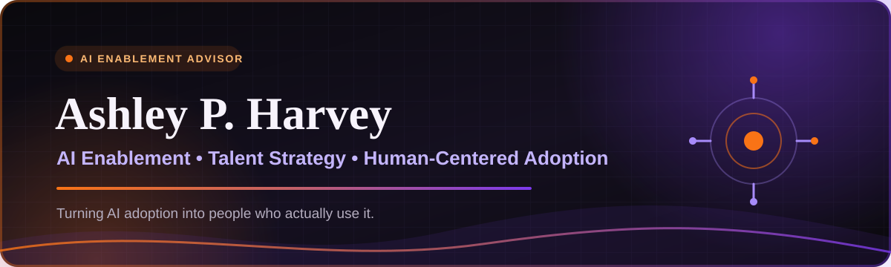

 

## 👋🏾 I make AI useful for the people expected to use it

I help non-technical teams turn AI from an impressive demo into a practical part of daily work. My approach blends **12+ years in recruiting and talent strategy** at Google, Salesforce, Amazon, Twitter, Evidation, and Gusto with hands-on AI training, workflow design, and responsible adoption.

> **The technology is only half the rollout. The other half is helping people understand it, trust it, and use it well.**

 

## ✦ What I build

<table>
<tr>
<td width="50%" valign="top">

### 🧠 AI Enablement
Role-specific training, prompt systems, learning programs, and adoption plans built for non-technical teams.

</td>
<td width="50%" valign="top">

### ⚙️ Workflow Design
Practical automations that reduce repetitive work while preserving human judgment and approval.

</td>
</tr>
<tr>
<td width="50%" valign="top">

### 🛠️ Custom AI Tools
GPTs, Claude Projects, NotebookLM systems, and knowledge tools designed around real business needs.

</td>
<td width="50%" valign="top">

### 🛡️ Responsible Adoption
Governance, confidentiality, bias awareness, and clear boundaries for safe workplace AI use.

</td>
</tr>
</table>

 

## ✦ Featured builds

| | Project | What it does |
|:--:|---|---|
| 🎓 | **[Your Next Skill](https://github.com/ashph/your-next-skill)** | Helps professionals identify what AI skill to learn next and build practical, role-relevant skills through guided learning paths. |
| 👻 | **GhosterBuster** | Tracks candidate status changes, drafts timely updates, and marks exactly where recruiter approval is required before sending. |
| 🎯 | **[RecruiterGPT](https://github.com/ashph/recruiter-gpt)** | Trains recruiters on unfamiliar roles through plain-language explanations, terminology, skill signals, transferable backgrounds, and guided practice. |
| 🤝 | **[Hiring Manager Intake](https://github.com/ashph/hiring-manager-intake)** | Cuts intake and calibration time by 70%, emailing a full role calibration, transferable skills, and working Boolean string in under two minutes. |
| ⚖️ | **[BiasBreaker / Transferable Skills Match](https://github.com/ashph/biasbreaker)** | Compares job requirements with résumé evidence without ranking candidates, surfacing transferable skills plus suggested hiring and onboarding plans. |

 

## ✦ Training portfolio

 

<strong>📈 Experience highlights</strong>

 

- Partnered with Gusto's Co-Founder and CTO on AI and technical hiring strategy.
- Managed a pipeline of 600+ AI candidates while supporting senior technical and business hiring.
- Contributed to 70% of the Salesforce Equality Talent team's hires with a 100% offer-acceptance rate.
- Reduced time to hire by 35% at Evidation.
- Built recruiting and talent programs across Google, Salesforce, Amazon, Twitter, Walmart eCommerce, Yahoo, and high-growth startups.

<strong>🎓 AI credentials</strong>

 

- AI Strategy and Governance — University of Pennsylvania
- AI for People Management — University of Pennsylvania
- AI Fundamentals for Non-Data Scientists — University of Pennsylvania
- Google AI Essentials
- IBM Generative AI Fundamentals
- Salesforce Certified AI Associate

<strong>🧰 Tools</strong>

 

`ChatGPT` · `Claude` · `Gemini` · `NotebookLM` · `Make` · `n8n` · `Canva` · `HeyGen` · `Google Workspace` · `Greenhouse`

 

### Learn AI without being an engineer.

**AI strategy • Enablement • Training • Workflow design**

